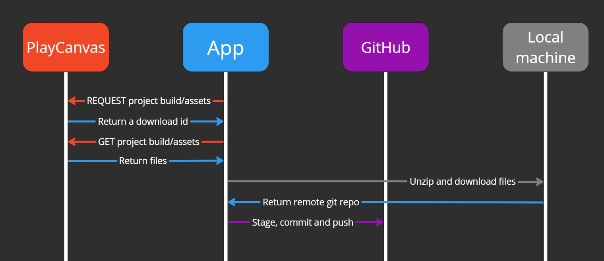
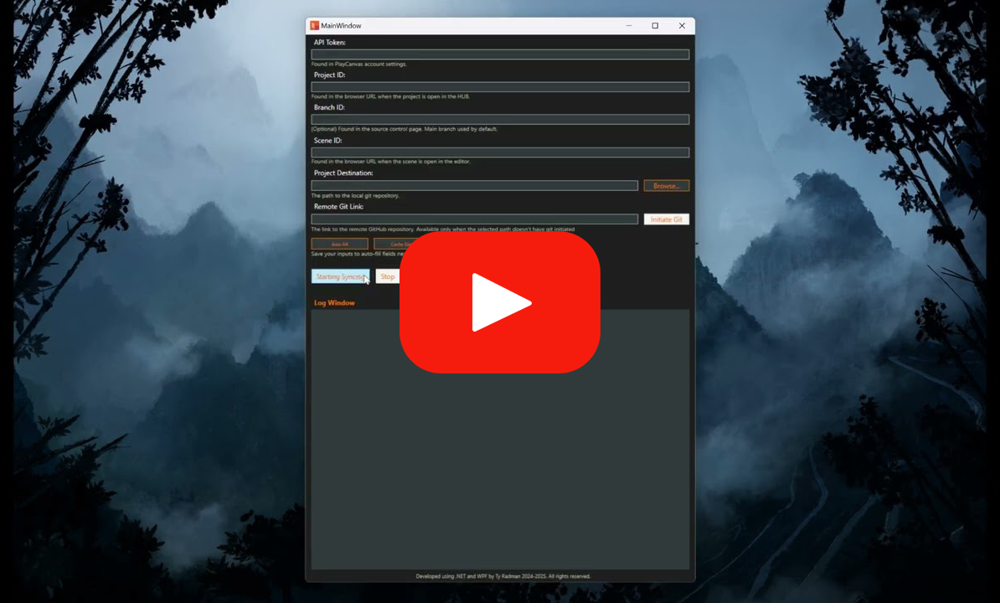

# PlayCanvas/GitHub Sync Tool

  
  
  
  

## Overview

The PlayCanvas to GitHub Sync Tool is a C# .NET WPF application designed to automate the process of syncing PlayCanvas projects with GitHub repositories which isn't supported by PlayCanvas. This tool allows users to seamlessly download PlayCanvas project builds, assets, or both, and push them to a specified GitHub repository. It is built with a user-friendly interface and a log window to ensure clarity and transparency throughout the sync process with an automatically generated `log.txt` file to keep a record of the sync history.

This application is ideal for developers and teams working with PlayCanvas (like myself) who need to maintain version control and backup their projects on GitHub.

---

## Key Features

- **Project Sync**: Locally download PlayCanvas project builds, assets, or both, and push them to a GitHub repository.
- **User-Friendly Interface**: Input fields for PlayCanvas project ID, scene ID, API token, GitHub repository URL, PlayCanvas branch ID, and local repository path.
- **Flexible Sync Options**: Choose to sync only the project build, only the assets, or both.
- **Detailed Logging**: A log window that displays the entire process, including connection status, download progress, Git operations, and error messages.
- **Automated Git Operations**: Handles cloning, committing with an optional message, and pushing changes to the specified GitHub repository.

---

## How It Works

1. **Input Configuration**:
   - Enter the required details in the application:
     - **PlayCanvas Project ID**: The unique identifier for the PlayCanvas project.
     - **API Token**: The PlayCanvas API token for authentication.
     - **GitHub Repository URL**: The remote Git repository link where the files will be pushed.
     - **Local Repository Path**: The directory on your machine where the repository will be cloned or updated.
   - Optional areas:
     - **Scene ID**: The ID of the scene you want to sync (all scenes will be included by default).
     - **PlayCanvas Branch ID**: The branch ID in PlayCanvas to sync from (the main branch will be used by default).
     - **Commit message**: The message for the commit (a default message is sent if the area is blank).

2. **Select Sync Options**:
   - Choose whether to sync:
     - **Project Build**: Downloads the PlayCanvas project build.
     - **Project Assets**: Downloads the PlayCanvas project assets (so far, the app filters the project assets to be script assets, as this was what I wanted to have on my repository).
     - **Both**: Downloads both the build and assets.

3. **Start the Sync Process**:
   - Click the "Sync" button to initiate the process. The application will:
     - Connect to PlayCanvas using the provided credentials.
     - Download the selected items (build, assets, or both), unzip them, move them to the specified directory.
     - Clone or update the local repository.
     - Commit and push the changes to the specified GitHub repository.

4. **Monitor Progress**:
   - The log text area provides real-time updates on the sync process, including:
     - Connection status with PlayCanvas and GitHub.
     - Download progress.
     - Git operations (cloning, committing, pushing).
     - Success messages or error details.

---

## Use Cases

- **Version Control**: Automatically sync PlayCanvas projects to GitHub for version control and backup.
- **Team Collaboration**: Share PlayCanvas project builds and assets with team members via GitHub.
- **Automation**: Eliminate manual steps in syncing PlayCanvas projects with GitHub, saving time and reducing errors.

---

## Logging

The log text area provides a comprehensive overview of the sync process, including:

- Connection status with PlayCanvas and GitHub.
- Download progress for builds and assets.
- Git operations (cloning, committing, pushing).
- Success messages or detailed error reports.

All logs are automatically saved to a `log.txt` file, which is generated in the application's directory.

---

## Built With

- **C#**: The primary programming language.
- **.NET**: The framework for building the application.
- **WPF (Windows Presentation Foundation)**: For the user interface.
- **PlayCanvas API**: For interacting with PlayCanvas projects.
- **Git**: For version control and repository management.

---

## Links

